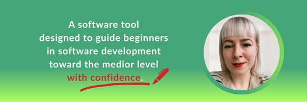

# 🧠 👊 Brain Locatio

## 🛣️ Software engineer's roadmap 👇

---

### 🧑‍💻 Programming Language Proficiency
- Python Basics
- Code and Documentation Reading

---

### 📊 Algorithmization
- Logical Thinking and Reasoning
- Data Structures and Algorithms

---

### 🚀 Intermediate Concepts 
- API authentication, security and caching
- DevOps Foundations, Using version control effectively

---

### 🧩 Early Advanced Stage - System design
- Scalable, maintainable, resilient, high availability and reliable architecture

---

### 💡 Master-Level Reasoning
- Architectural patterns and principles (DDD, SOA, EDA)

## 🛠️ Project Setup

### Code Analysis

**Configuration Sources:**
- **Black** — configured in [`pyproject.toml`](./setup.cfg)
- **Mypy** — configured in [`mypy.ini`](./mypy.ini)

**Orchestration:**
- **Pre-commit hooks** — managed via [`.pre-commit-config.yaml`](./.pre-commit-config.yaml)