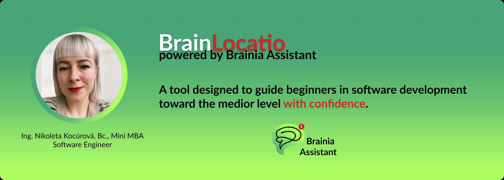
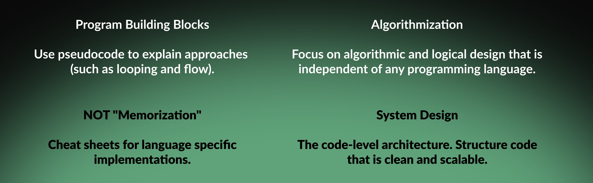
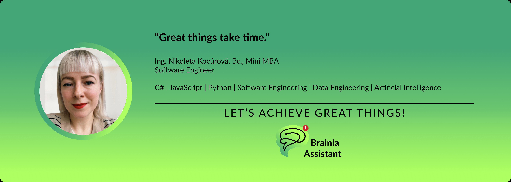

# 🧠 👊 Brain Locatio

[](https://github.com/psf/black)
[](link-to-workflow)
[](LICENSE)



# 👋 Dear IT Enthusiast, Welcome to My GitHub Profile!

## About Me

👋 **I’m the Founder of Braina Assistant.**

Diving into **data science, software engineering, and data engineering** topics.
Shaping the future of innovation in education - because let’s face it, **nobody wants to get left behind**.

You can learn more about my professional background and view my CV on [LinkedIn](https://www.linkedin.com/in/ing-nikoleta-kocurova-bc-mini-mba-295a5011b/).

Let’s journey through the Software Engineer’s roadmap together and achieve great things! 👊

---

---

---

## 🔼 🔽 Project Navigation

- 🤖 Semantic Search with Gen AI: [artificial-intelligence](artificial-intelligence)
- 🧑‍💻 Simple C# Console Application: [csharp](csharp)
- 🧑‍💻 Algorithmization LeetCode Solutions: [data-structures-and-algorithms](data-structures-and-algorithms)
- 💾 Database LeetCode Solutions: [database](database)
- 🌐 Django Full Stack: [django-fullstack](django-fullstack)
- 📡 IoT: [internet-of-things](internet-of-things)

---

---

---

## 🛣️ Software engineer's roadmap 👇

---

### 🧑‍💻 Logical Thinking & Reasoning

- Brain teasers, Logic, Tricky Implementations
- Input Analysis. Data Structures and Algorithmic Solutions.
- Code-Level System Design & Code Quality.



---

### 🚀 Intermediate Concepts 
- API security and DB caching
- DevOps Foundations, Using version control effectively

---

### 🧩 Early Advanced Stage - System design
- Scalable, maintainable, resilient, high availability and reliable architecture

---

### 💡 Master-Level Reasoning
- Architectural patterns and principles (DDD, SOA, EDA)

---

---

---

## 🛠️ Project Setup

### Code Analysis - Python
 
**Initial setup:** ```chmod +x install.sh && ./install.sh```

**Configuration Sources:**
- **Flake8** - configured in [`setup.cfg`](./setup.cfg)
- **Black** - configured in [`.pre-commit-config.yaml`](./.pre-commit-config.yaml)

**Orchestration:**
- **Pre-commit hooks** — managed via [`.pre-commit-config.yaml`](./.pre-commit-config.yaml)

### Testing

Properties **"scripts"** & **"devDependencies"** in [`package.json`](package.json)


