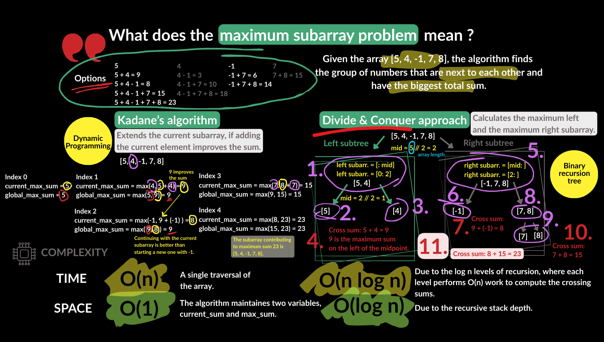

# Maximum Subarray

Leet Code reference: https://leetcode.com/problems/maximum-subarray/description/

Topic: List, Divide and Conquer (Binary recursion tree), Dynamic programming (Kadane's Algorithm)

## Description

Given an integer array nums, find the subarray with the largest sum, and return its sum.

A subarray is a contiguous non-empty sequence of elements within an array.

Constraints:

- 1 <= nums.length <= 105
- -104 <= nums[i] <= 104

Follow up: If you have figured out the O(n) solution, try coding another solution using the divide and conquer approach, which is more subtle.

## Additional notes

**Kadane's Algorithm**

It dynamically decides:
- Extend the current subarray: When adding the current element improves the sum.
- Start a new subarray: When the current element alone is larger than the previous subarray sum.

**Divide and conquer approach**

This approach splits the array into halves, solves each half recursively, and combines the results.

## Visualisation

