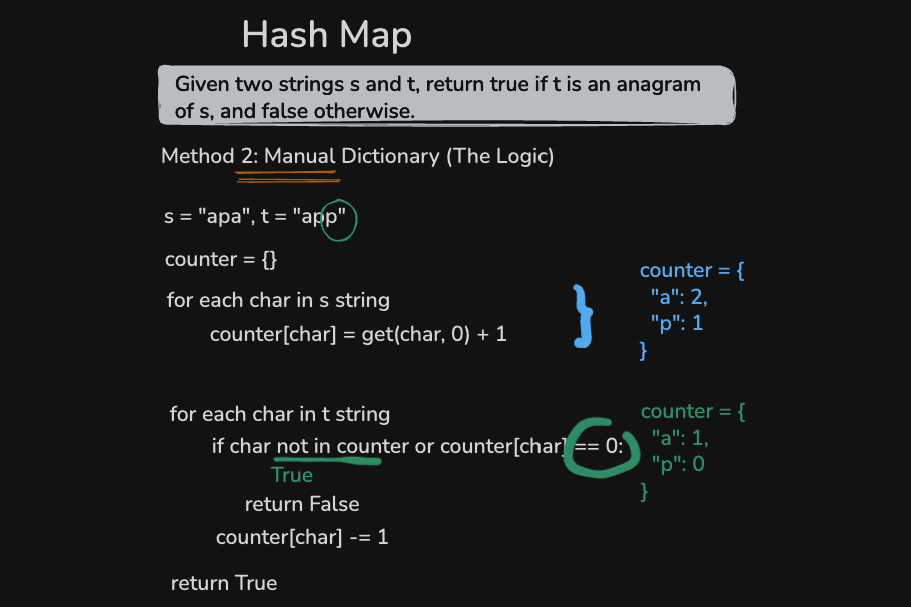

# 242. Valid anagram

Leet Code reference: https://leetcode.com/problems/valid-anagram/description/

Topics: Hash Table, String , Sorting

## Description

Given two strings s and t, return true if t is an anagram of s, and false otherwise.

Example 1:

    Input: s = "anagram", t = "nagaram"
    Output: true

Example 2:

    Input: s = "rat", t = "car"
    Output: false

Constraints:

- 1 <= s.length, t.length <= 5 * 10^4
- s and t consist of lowercase English letters.

## Input analysis

- Type: string, reference data type and immutable collection
- Range: lowercase English letters
- Uniqueness: elements are not unique
- Order: unsorted

## Visualisation

